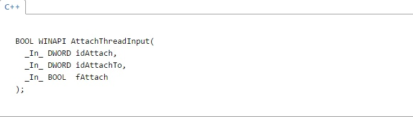
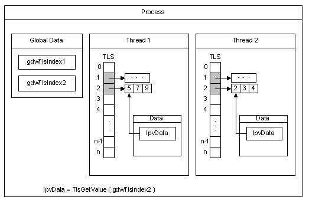

# 作業系統 OS_HW4 介紹thread相關 #  
s1003339 魏瑞辰  

**Thread**  
又稱線程、執行緒  

(1)執行緒（英語：thread）是作業系統能夠進行運算排程的最小單位。它被包含在行程之中，是行程中的實際運作單位。

(2)執行緒是獨立排程和分派的基本單位。

(3)同一行程中的多條執行緒將共享該行程中的全部系統資源，如虛擬位址空間，檔案描述符和訊號處理等等。

(4)一個行程可以有很多執行緒，每條執行緒並列執行不同的任務。

 ---------------------------------------------------------------------------------- 

**Thread Attach**  
連接線程，須分配儲存空間，而Thread-local storage是個好方法  

  

Thread-local storage(TLS)(線程本地存儲) 是使用靜態或全局內存本地線程的計算機編程方法。 
一個進程(process)的所有線程(thread)共享的虛擬地址空間(virtual address space)。函數的局部變量(local variables)是唯一的，運行該函數的每個線程。然而，靜態和全局變量由進程中的所有線程共享。隨著線程本地存儲（TLS），可以為每個線程唯一的數據，該過程可以使用全局索引(global index)來訪問。一個線程分配的索引(index)，可以使用由其他線程以檢索與索引相關聯的唯一的數據。 
當創建的線程，則系統分配LPVOID值對TLS，其被初始化為NULL的陣列。之前的索引都可以使用，它必須由一個線程被分配。每個線程將其數據存儲的TLS指數在TLS插槽數組中。 
下圖說明TLS如何工作的。

  
說明：該process具有兩個thread，Thread1和Thread2，分配兩個索引使用TLS，gdwTlsIndex1和gdwTlsIndex2使用。每個thread分配兩個存儲塊（每個index）在其中存儲的數據，並存儲pointers在相應的TLS插槽這些存儲器塊。通過訪問與索引相關聯的數據，該線程檢索pointer從所述TLS插槽，並將其存儲在lpvData局部變量的內存塊。 

  
後記：這是我找到最容易理解Thread-local storage(TLS)的說明了，參考WIKI和Microsoft Windows Dev Center，刪了一些不重要的資訊，不過重點還是超過了一千字，感覺刪掉就不完整了，所以決定超過字數。